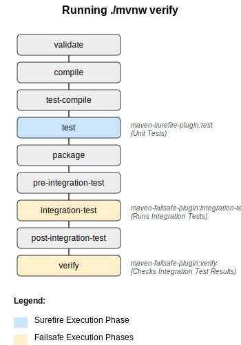

---

<!--

Question: Who is writing tests manually and who is enjoying it?

--> 


# Testing Spring Boot Applications Demystified

## Full-Day Workshop

_DATEV Coding Festival 09.10.2025_

Philip Riecks - [PragmaTech GmbH](https://pragmatech.digital/) - [@rieckpil](https://x.com/rieckpil)


--- 

<!--

- Welcome, Introduction
- Overview of the workshop  
- When to eat, toilet, WLAN

-->

<!-- header: 'Testing Spring Boot Applications Demystified Workshop @ DATEV Coding Festival 09.10.2025' -->
<!-- footer: '' -->

# Organization

- Slides & code will be shared: check [PragmaTech GitHub](https://github.com/PragmaTech-GmbH/workshop-datev-coding-festival-2025) in the linked resources within Zoom
- Workshop lab requirements
  - Java JDK 21
  - Docker for Testcontainers, consider Podman
  - GitHub Account (preferably a personal) to use GitHub Codespaces if the local setup is not possible

---

### (Planned) Timeline

- 9:00 - 10:30: **Lab 1 - Introduction and Spring Boot Testing Basics**  (90 minutes)
- 10:30 - 11:00: **Coffee Break** (30 minutes)
- 11:00 - 12:30: **Lab 2 - Sliced Testing** (90 minutes)
- 12:30 - 13:30 **Lunch** (60 minutes)
- 13:30 - 15:00: **Lab 3 - Integration Testing** (90 minutes)
- 15:00 - 15:30 **Coffee Break** (30 minutes)
- 15:30 - 17:00: **Lab 4 - Pitfalls, Best Practices, AI & Outlook** (90 minutes)

---


## Workshop Instructor: Philip

- Self-employed IT consultant from Herzogenaurach, Germany (Bavaria) 🍻
- Blogging & content creation for more than five years. Since three years with a focus on testing Java and specifically Spring Boot applications 🍃
- Founder of PragmaTech GmbH - Enabling Developers to Frequently Deliver Software with More Confidence 🚤
- Enjoys writing tests 🧪
- @rieckpil on various platforms

---

## Getting to Know Each Other

- What's your name and your role?
- What's one word that describes how you're feeling about automated testing?
- What's your expectation for this workshop?

---


# Lab 1

## Introduction and Spring Boot Testing Basics

---
<!-- paginate: true -->

<!-- header: '' -->
<!-- footer: '' -->
<!--


Notes:

- Raise hands if you enjoy writing tests -> I do and hope I can change that for some of you today
- Why do we Test Code?
- Why is testing an afterthought?
- How to make testing more joyful?


-->


# Getting Started with Testing

## How It Started

---

<!-- header: 'Testing Spring Boot Applications Demystified Workshop @ DATEV Coding Festival 09.10.2025' -->
<!-- footer: '' -->

<!--
- My story towards testing
- What I mean with testing: automated tests written by a developer
- Shifting left
- How much confidence do I have to deploy on a friday afternoon to prod on a dependabot update?
- Don't work towards 100% code coverage
- Fast feedback loops
- Quicker development, errors pop up more early, wouldn't say bugs, but sometimes we are overconfident only to realize after the deployment we missed a parameter or misspelled it. Avoid friction


-->

### Getting Used To Testing At Work


---

# Goals of this Workshop

- Demystify the complexities of testing Spring Boot applications
- Provide clear explanations, practical insights, and actionable best practices
- Become more productive and confident in your development and testing efforts

---

<!-- _class: section -->

# Spring Boot Testing Basics
## Spring Boot Starter Test, Build Tools, Conventions, Unit Testing

---


## My Overall Northstar

Imagine seeing this pull request on a Friday afternoon:


How confident are you to merge this major Spring Boot upgrade and deploy it to production once the pipeline turns green?

Good tests don't just catch bugs - they give you the confidence to say "yes" without hesitation.

---

## Why Do We Test Software

- Shift Left
- Catch Bugs Early
- Confidence in Code Changes
- Documentation
- Regression Prevention
- Become more Productive
- Use Tests as a Playground to Explore New Technologies

---

<style>
img[alt~="center"] {
  display: block;
  margin: 0 auto;
}
</style>

### Naming Things Is Hard


---

### My Pragmatic Test Name Approach

<br/>

1. **Unit Tests**: Tests that verify the functionality of a single, isolated component (like a method or class) by mocking or stubbing all external dependencies.

<br/>

2. **Integration Tests**: Tests that verify interactions between two or more components work correctly together, with real implementations replacing some mocks.

<br/>

3. **E2E**: Tests that validate the entire application workflow from start to finish, simulating real user scenarios across all components and external dependencies.

---

## Maven Build Lifecycle



- **Maven Surfire Plugin** for unit tests: default postfix  `*Test` (e.g. `CustomerTest`)
- **Maven Failsafe Plugin** for integration tests: default postfix `*IT` (e.g. `CheckoutIT`)
- Reason for splitting: different **parallelization** options, better **organisation**

---

### Spring Boot Starter Test

<!--

Notes:

- Show the `spring-boot-starter-test` dependency and Maven dependency tree
- Show manual overriden


-->


- aka. "Testing Swiss Army Knife"
- Batteries-included for testing
- Dependency management for:
  - JUnit Jupiter
  - Mockito
  - AssertJ
  - Awaitility
  - etc.
- We can manually override the dependency versions

---

<!--
Notes:
- Go to IDE to show the start
- Navigate to the parent pom to see the management
- Show the sample test to have seen the libraries at least once

Tips:
- Favor JUnit 5 over JUnit 4
- Pick one assertion library or at least not mix it within the same test class
-->

```shell
[INFO] +- org.springframework.boot:spring-boot-starter-test:jar:3.5.6:test
[INFO] |  +- org.springframework.boot:spring-boot-test:jar:3.5.6:test
[INFO] |  +- org.springframework.boot:spring-boot-test-autoconfigure:jar:3.5.6:test
[INFO] |  +- com.jayway.jsonpath:json-path:jar:2.9.0:test
[INFO] |  +- jakarta.xml.bind:jakarta.xml.bind-api:jar:4.0.2:test
[INFO] |  |  \- jakarta.activation:jakarta.activation-api:jar:2.1.3:test
[INFO] |  +- net.minidev:json-smart:jar:2.5.2:test
[INFO] |  |  \- net.minidev:accessors-smart:jar:2.5.2:test
[INFO] |  |     \- org.ow2.asm:asm:jar:9.7.1:test
[INFO] |  +- org.assertj:assertj-core:jar:3.26.3:test
[INFO] |  |  \- net.bytebuddy:byte-buddy:jar:1.15.11:test
[INFO] |  +- org.awaitility:awaitility:jar:4.3.0:test
[INFO] |  +- org.hamcrest:hamcrest:jar:2.2:test
[INFO] |  +- org.junit.jupiter:junit-jupiter:jar:5.11.4:test
[INFO] |  |  +- org.junit.jupiter:junit-jupiter-api:jar:5.11.4:test
[INFO] |  |  |  +- org.junit.platform:junit-platform-commons:jar:1.11.4:test
[INFO] |  |  |  \- org.apiguardian:apiguardian-api:jar:1.1.2:test
[INFO] |  |  +- org.junit.jupiter:junit-jupiter-params:jar:5.11.4:test
[INFO] |  |  \- org.junit.jupiter:junit-jupiter-engine:jar:5.11.4:test
[INFO] |  |     \- org.junit.platform:junit-platform-engine:jar:1.11.4:test
[INFO] |  +- org.mockito:mockito-core:jar:5.17.0:test
[INFO] |  |  +- net.bytebuddy:byte-buddy-agent:jar:1.15.11:test
[INFO] |  |  \- org.objenesis:objenesis:jar:3.3:test
[INFO] |  +- org.mockito:mockito-junit-jupiter:jar:5.17.0:test
[INFO] |  +- org.skyscreamer:jsonassert:jar:1.5.3:test
[INFO] |  |  \- com.vaadin.external.google:android-json:jar:0.0.20131108.vaadin1:test
[INFO] |  +- org.springframework:spring-core:jar:6.2.6:compile
[INFO] |  |  \- org.springframework:spring-jcl:jar:6.2.6:compile
[INFO] |  +- org.springframework:spring-test:jar:6.2.6:test
[INFO] |  \- org.xmlunit:xmlunit-core:jar:2.10.0:test
```

---

## Transitive Test Dependency: JUnit 5

- Modern testing framework for Java applications
- Rewrite of JUnit 4
- JUnit 5 = JUnit Jupiter + JUnit Vintage + JUnit Platform
- Key features: parameterized tests, nested tests, extensions, parallelization

```java
@Test
void shouldCreateNewBook() {
  Book book = new Book("1234", "Spring Boot Testing", "Test Author");

  assertEquals("1234", book.getIsbn());
}

```

---

## Transitive Test Dependency: Mockito

- Mocking framework for unit tests
- Used to isolate the class under test from its dependencies
- Allows verification of interactions between objects
- Golden Mockito Rules:
  - Don't mock what you don't own
  - Don't mock value objects
  - Don't mock everything
  - Show some love with your tests

---


```java
@ExtendWith(MockitoExtension.class)
class BookServiceTest {
  
  @Mock
  private BookRepository bookRepository;
  
  @InjectMocks
  private BookService bookService;
  
  @Test
  void shouldReturnBookWhenFound() {
    when(bookRepository.findByIsbn("1234")).thenReturn(Optional.of(expectedBook));
    
    Optional<Book> result = bookService.getBookByIsbn("1234");
    
    verify(bookRepository).findByIsbn("1234");
  }
}
```

---


## Transitive Test Dependency: AssertJ

- Fluent assertion library for Java tests
- Provides more readable, chain-based assertions
- Rich set of assertions for collections, exceptions, and more

```java
@Test
void shouldProvideFluentAssertions() {
  List<Book> books = List.of(
    new Book("1234", "Spring Boot Testing", "Test Author"),
    new Book("5678", "Advanced Spring", "Another Author")
  );
  
  assertThat(books)
    .hasSize(2)
    .extracting(Book::getTitle)
    .containsExactly("Spring Boot Testing", "Advanced Spring");
}
```

---

## Transitive Test Dependency: Hamcrest

- Fluent assertion library
- Occasionally used within Spring Test, e.g. MockMvc verifications
- Implementation for many other programming languages

```java
@Test
void shouldMatchWithHamcrest() {
  Book book = new Book("1234", "Spring Boot Testing", "Test Author");
  
  assertThat(book.getIsbn(), is("1234"));
  assertThat(book.getTitle(), allOf(
    startsWith("Spring"),
    containsString("Testing"),
    not(emptyString())
  ));
}
```
---

## Transitive Test Dependency: Awaitility

- Library for testing asynchronous code
- Provides a DSL for expressing expectations on async operations
- Great for testing concurrent code and background tasks


---

```java
@Test
void shouldEventuallyCompleteAsyncOperation() {
  CompletableFuture<Book> futureBook = CompletableFuture.supplyAsync(() -> {
    try {
      Thread.sleep(300);
      return new Book("1234", "Async Testing", "Author");
    } catch (InterruptedException e) {
      return null;
    }
  });
  
  await()
    .atMost(1, TimeUnit.SECONDS)
    .until(futureBook::isDone);
}
```

---

## Transitive Test Dependency: JsonPath

- Library for parsing and evaluating JSON documents
- Used for extracting and asserting on JSON structures
- Especially useful in REST API testing

```java
@Test
void shouldParseAndEvaluateJson() throws Exception {
  String json = """
    { "book": {"isbn": "1234", "title": "JSON Testing", "author": "Test Author"}}""";
  
  DocumentContext context = JsonPath.parse(json);
  
  assertThat(context.read("$.book.isbn", String.class)).isEqualTo("1234");
  assertThat(context.read("$.book.title", String.class)).isEqualTo("JSON Testing");
}
```

---

## Transitive Test Dependency: JSONAssert

- Assertion library for JSON data structures
- Provides powerful comparison of JSON structures
- Supports strict and lenient comparison modes

```java
@Test
void shouldAssertJsonEquality() throws Exception {
  String actual = """
    { "isbn": "1234", "title": "JSON Testing", "author": "Test Author"}""";

  String expected = """
    { "isbn": "1234", "title": "JSON Testing"}""";

  // Strict mode would fail as expected is missing the author field
  JSONAssert.assertEquals(expected, actual, false);
}
```

---

## Transitive Test Dependency: XMLUnit

- Library for testing XML documents
- Provides comparison and validation of XML
- Useful for testing SOAP services or XML outputs

```java
@Test
void shouldCompareXmlDocuments() {
  String control = "<book><isbn>1234</isbn><title>XML Testing</title></book>";
  String test = "<book><isbn>1234</isbn><title>XML Testing</title></book>";
  
  Diff diff = DiffBuilder.compare(Input.fromString(control))
    .withTest(Input.fromString(test))
    .build();
  
  assertFalse(diff.hasDifferences(), diff.toString());
}
```

---

## Design For (Unit) Testability with Spring Boot

- Provide collaborators from outside (dependency injection) -> no `new` inside your code
- Develop small, single responsibility classes
- Test only the public API of your class
- Verify behavior not implementation details
- TDD can help design (better) classes

---
### Avoid Static Method Access

```java
@Service
public class BirthdayService {

  public boolean isTodayBirthday(LocalDate birthday) {
    LocalDate today = LocalDate.now();

    return today.getMonth() == birthday.getMonth()
      && today.getDayOfMonth() == birthday.getDayOfMonth();
  }
}
```

---

### Better Alternative

```java
@Service
public class BirthdayServiceWithClock {

  private final Clock clock;

  public BirthdayServiceWithClock(Clock clock) {
    this.clock = clock;
  }

  public boolean isTodayBirthday(LocalDate birthday) {
    LocalDate today = LocalDate.now(clock);

    return today.getMonth() == birthday.getMonth()
      && today.getDayOfMonth() == birthday.getDayOfMonth();
  }
}
```

---

```java
@Test
void shouldReturnTrueWhenTodayIsBirthday() {
  // Arrange
  LocalDate fixedDate = LocalDate.of(2025, 5, 15);
  Clock fixedClock = Clock.fixed(
    fixedDate.atStartOfDay(ZONE_ID).toInstant(),
    ZONE_ID
  );

  BirthdayServiceWithClock cut = new BirthdayServiceWithClock(fixedClock);
  LocalDate birthday = LocalDate.of(1990, 5, 15); // Same month and day

  // Act
  boolean result = cut.isTodayBirthday(birthday);

  // Assert
  assertThat(result).isTrue();
}
```

---

### Check Your Imports

- Nothing Spring-related here
- Rely only on JUnit, Mockito and an assertion library

```java
import org.junit.jupiter.api.DisplayName;
import org.junit.jupiter.api.Nested;
import org.junit.jupiter.api.Test;
import org.junit.jupiter.api.extension.ExtendWith;
import org.junit.jupiter.params.ParameterizedTest;
import org.junit.jupiter.params.provider.CsvSource;
import org.mockito.Mock;
import org.mockito.junit.jupiter.MockitoExtension;

import static org.assertj.core.api.Assertions.assertThat;
```

---

### Unify Test Structure

- Use a consistent test method naming: givenWhenThen, shouldWhen, etc.
- Structure test for the Arrange/Act/Assert test setup

```java
@Test
void should_When_() {

  // Arrange
  // ... setting up objects, data, collaborators, etc.

  // Act
  // ... performing the action to be tested on the class under test

  // Assert
  // ... verifying the expected outcome
}
```

---

<!-- _class: code -->

## A Standard Unit Test

```java
@Test
void testBookService() {
    // Given
    Book book = new Book("123", "Test Book", "Test Author");
    when(bookRepository.findById("123")).thenReturn(Optional.of(book));
    
    // When
    Optional<Book> result = bookService.getBookById("123");
    
    // Then
    assertTrue(result.isPresent());
    assertEquals("Test Book", result.get().getTitle());
    verify(bookRepository).findById("123");
}
```

---

## JUnit Jupiter Extension API

- Important concept to understand
- Makes JUnit Jupiter extensible
- `SpringExtension` provides Spring integration
- Successor of JUnit 4's `@RunWith`/`@Rule` API


```java
@ExtendWith(MockitoExtension.class)
class BookServiceTest {

}
```

---

## JUnit Jupiter Extension Points

- Lifecycle Callbacks: `BeforeEachCallback`, `AfterAllCallback`, etc.
- Parameter Resolution: `ParameterResolver`
- Exception Handling: `TestExecutionExceptionHandler`
- Conditional Test Execution: `ExecutionCondition`
- Test Instance Factories: `TestInstanceFactory`, `TestInstancePostProcessor`

---

## Create a Custom Extension

```java
public class TimingExtension implements BeforeTestExecutionCallback, AfterTestExecutionCallback {
  
    private static final Logger logger = LoggerFactory.getLogger(TimingExtension.class);
    
    @Override
    public void beforeTestExecution(ExtensionContext context) {
        getStore(context).put("start", System.currentTimeMillis());
    }
    
    @Override
    public void afterTestExecution(ExtensionContext context) {
        long start = getStore(context).remove("start", Long.class);
        long duration = System.currentTimeMillis() - start;
        logger.info("Test {} took {} ms", context.getDisplayName(), duration);
    }
    
    private Store getStore(ExtensionContext context) {
        return context.getStore(Namespace.create(getClass(), context.getRequiredTestMethod()));
    }
}
```

---

# Time For Some Exercises
## Lab 1

- Set up the [repository](https://github.com/PragmaTech-GmbH/workshop-datev-coding-festival-2025) locally - https://github.com/PragmaTech-GmbH/workshop-datev-coding-festival-2025
- Work locally (requires Podman and Java 21) or use GitHub Codespaces (120 hours/month free)
- For Codespaces, pick at least 4-Cores (16 GB RAM) and region `Europe West`
- Navigate to the `labs/lab-1` folder in the repository and complete the tasks as described in the `README` file of that folder 
- Time boxed until the end of the coffee break (11:00 AM)
