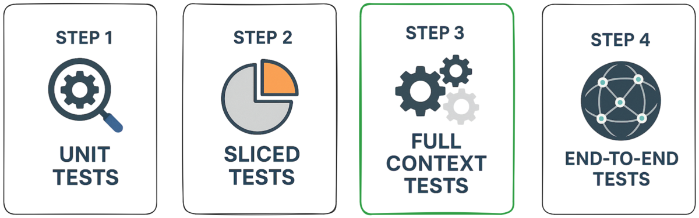
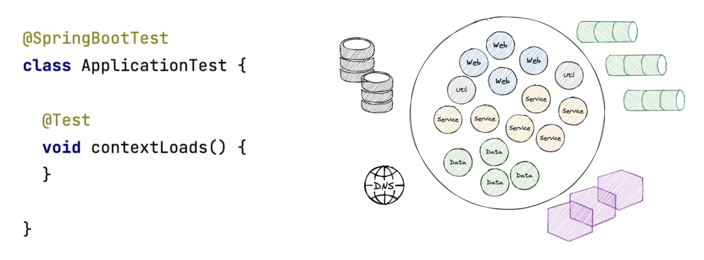
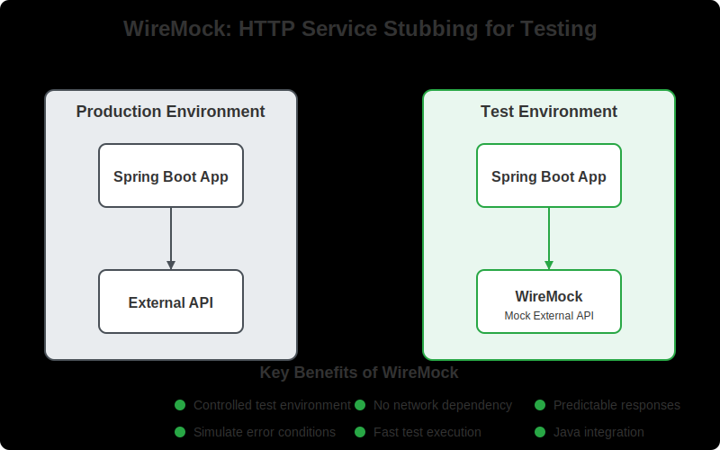
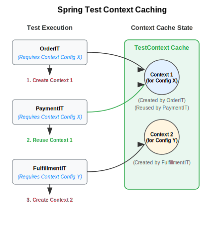
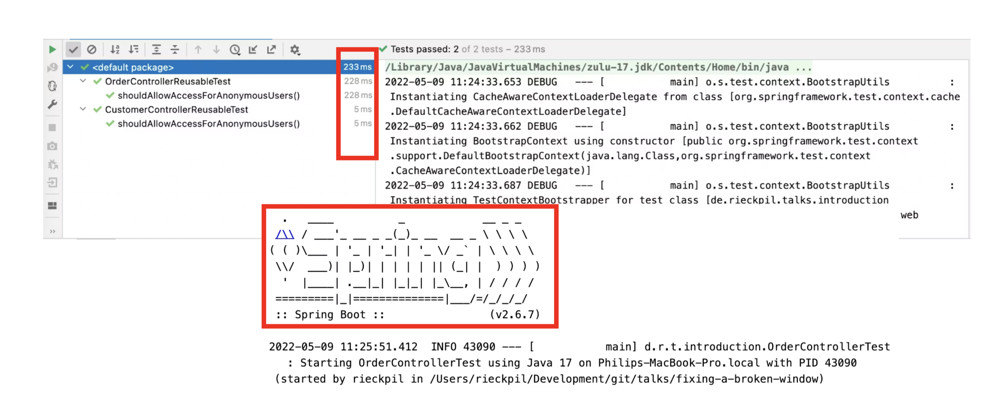
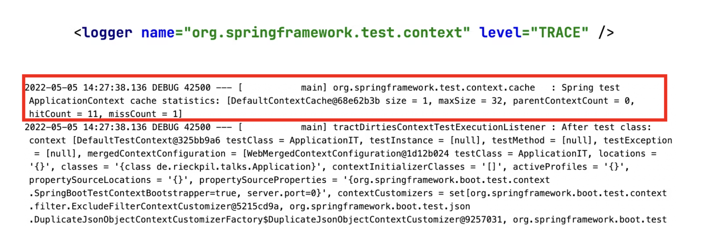
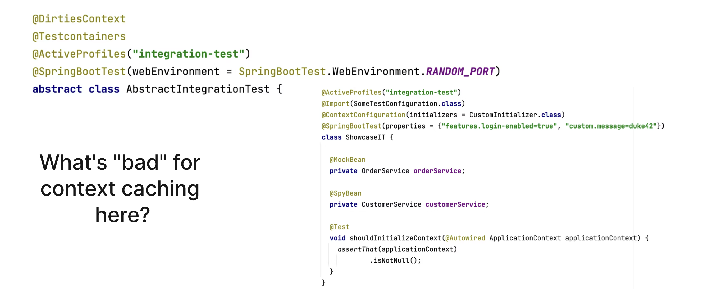

---

<style>
img[alt~="center"] {
  display: block;
  margin: 0 auto;
}
</style>

<!-- _class: title -->


# Testing Spring Boot Applications Demystified

## Full-Day Workshop

_DATEV Coding Festival 09.10.2025_

Philip Riecks - [PragmaTech GmbH](https://pragmatech.digital/) - [@rieckpil](https://x.com/rieckpil)

---

## Discuss Exercises from Lab 2

---

<!-- header: 'Testing Spring Boot Applications Demystified Workshop @ DATEV Coding Festival 09.10.2025' -->
<!-- footer: '' -->


# Lab 3

## Integration Testing: Testing against a full Spring TestContext

---

## Full Context Testing Spring Boot Applications



---

## Integration Testing Spring Boot Applications 101

- **Core Concept**: Start the entire Spring application context, often on a random local port, and test the application through its external interfaces (e.g., REST API).

- **Confidence Gained**: Validates the integration of all internal components working together as a complete application.

- **Best Practices**: Use `@SpringBootTest` to run the app on a local port.

- **Pitfalls**: Slower to run than unit or sliced tests. Managing the lifecycle of dependent services can be complex.

- **Tools**: JUnit, Mockito, Spring Test, Spring Boot, Testcontainers, WireMock (for mocking external HTTP services), Selenium (for browser-based UI testing)

---

<!-- _class: section -->

# Starting Everything
## Writing Tests Against a Complete Application Context


---

<!--

Notes:

-->

## The Default Integration Test

Each new Spring Boot project comes with a default integration test:



---

## Main Challenges of Full Context Integration Tests

- Starting the entire Spring context can be slow, repeated context starts will slow down the build
- External infrastructure components (databases, message brokers, etc.) need to be provided
- HTTP communication with other services needs to be stubbed both during startup and during runtime
- Test data management (setup and cleanup) is crucial to ensure test reliability

---

## Starting the Entire Context

- Provide external infrastructure with [Testcontainers](https://testcontainers.com/)
- Start Tomcat with: `@SpringBootTest(webEnvironment = WebEnvironment.RANDOM_PORT)`
- Test controller endpoints via: `MockMvc` (no real HTTP communication), `WebTestClient` (real HTTP communication), `TestRestTemplate` (real HTTP communication)
- Consider WireMock/MockServer for stubbing dependent HTTP services

---

## Introducing: Microservice HTTP Communication

Our library application got a new feature. We now fetch book metadata from a [remote service](https://openlibrary.org/api/books?jscmd=data&format=json&bibkeys=9780132350884):

```java
webClient.get()
  .uri(
    "/api/books",
    uriBuilder ->
      uriBuilder
        .queryParam("jscmd", "data")
        .queryParam("format", "json")
        .queryParam("bibkeys", isbn)
        .build())
  .retrieve();
}
```

---

## HTTP Communication During Tests

- Unreliable when performing real HTTP responses during tests
- Sample data? 
- Authentication?
- Cleanup?
- No airplane-mode testing possible anymore
- Solution: Stub the HTTP responses for remote system

---



---

## Introducing WireMock

- In-memory (or container) Jetty to stub HTTP responses
- Simulate failures, slow responses, etc.
- Stateful setups possible (scenarios): first request fails, then succeeds
- Alternatives: MockServer, MockWebServer, etc.

```java
wireMockServer.stubFor(
  get(urlPathEqualTo("/api/books/" + isbn))
     // ... query param matchers
    .willReturn(aResponse()
      .withHeader(HttpHeaders.CONTENT_TYPE, MediaType.APPLICATION_JSON_VALUE)
      .withBodyFile(isbn + "-success.json"))
);
```

---

## Making Our Application Context Start

Next challenge: Our application makes HTTP calls during startup to fetch some initial data.

- We need to stub HTTP responses during the launch of our Spring Context
- Introducing a new concept: `ContextInitializer`

```java
WireMockServer wireMockServer = new WireMockServer(WireMockConfiguration.wireMockConfig().dynamicPort());

wireMockServer.start();

// Register a shutdown hook to stop WireMock when the context is closed
applicationContext.addApplicationListener(event -> {
  if (event instanceof ContextClosedEvent) {
    logger.info("Stopping WireMock server");
    wireMockServer.stop();
  }
});

TestPropertyValues.of(
  "book.metadata.api.url=http://localhost:" + wireMockServer.port()
).applyTo(applicationContext);
```

---
<!--

- Go to `DefaultContextCache` to show the cache

-->

## Spring Test `TestContext` Caching

- Part of Spring Test (automatically part of every Spring Boot project via `spring-boot-starter-test`)
- Spring Test caches an already started Spring `ApplicationContext` for later reuse
- Cache retrieval is usually faster than a cold context start
- Configurable cache size (default is 32) with LRU (least recently used) strategy

Speed up your build:


---

## Caching is King



---

## How the Cache Key is Built

This goes into the cache key (`MergedContextConfiguration`):

- activeProfiles (`@ActiveProfiles`)
- contextInitializersClasses (`@ContextConfiguration`)
- propertySourceLocations (`@TestPropertySource`)
- propertySourceProperties (`@TestPropertySource`)
- contextCustomizer (`@MockitoBean`, `@MockBean`, `@DynamicPropertySource`, ...)

---
## Identify Context Restarts




---

## Investigate the Logs



---

## Spring Test Profiler


A Spring Test utility that provides visualization and insights for Spring Test execution, with a focus on Spring context caching statistics. 

**Overall goal**: Identify optimization opportunities in your Spring Test suite to speed up your builds and ship to production faster and with more confidence.

---

## Spot the Issues for Context Caching



---

## Context Caching Issues

Common problems that break caching:

1. Different context configurations
2. `@DirtiesContext` usage
3. Modifying beans in tests
4. Different property settings
5. Different active profiles

---

## Make the Most of the Caching Feature


- Avoid `@DirtiesContext` when possible, especially at `AbstractIntegrationTest` classes
- Understand how the cache key is built
- Monitor and investigate the context restarts
- Align the number of unique context configurations for your test suite

---

# Time For Some Exercises
## Lab 3

- Work with the same repository as in lab 1/lab 2
- Navigate to the `labs/lab-3` folder in the repository and complete the tasks as described in the `README` file of that folder
- Time boxed until the end of the coffee break (15:30 AM)
